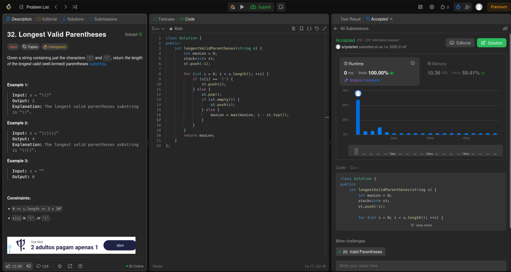
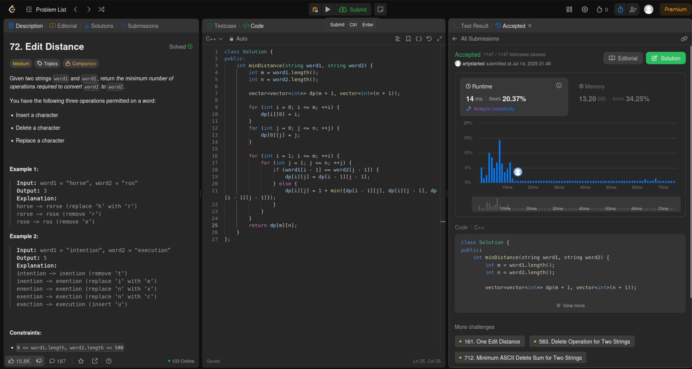
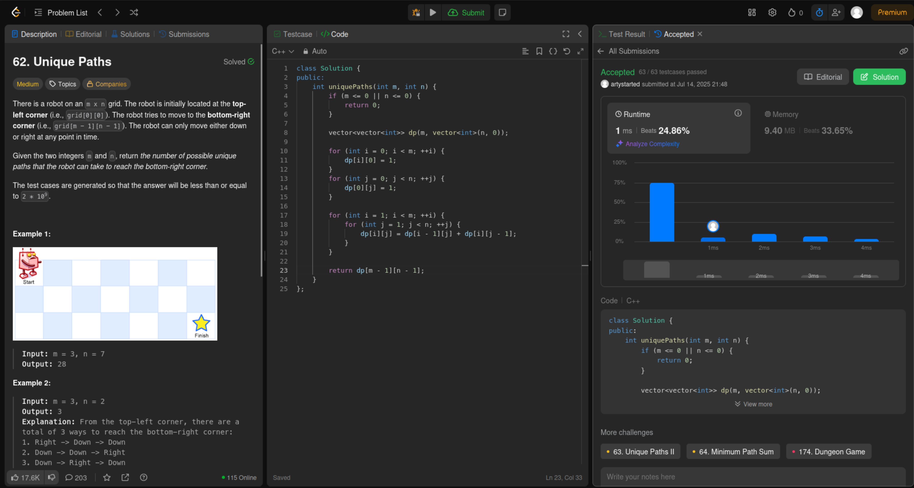
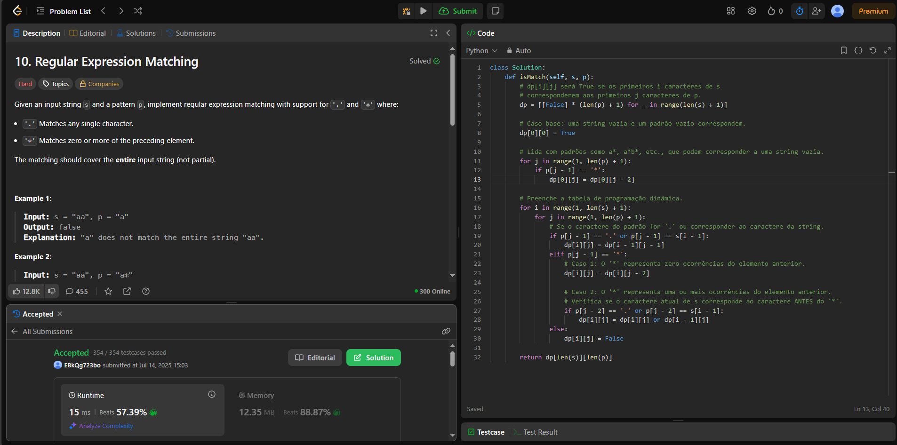
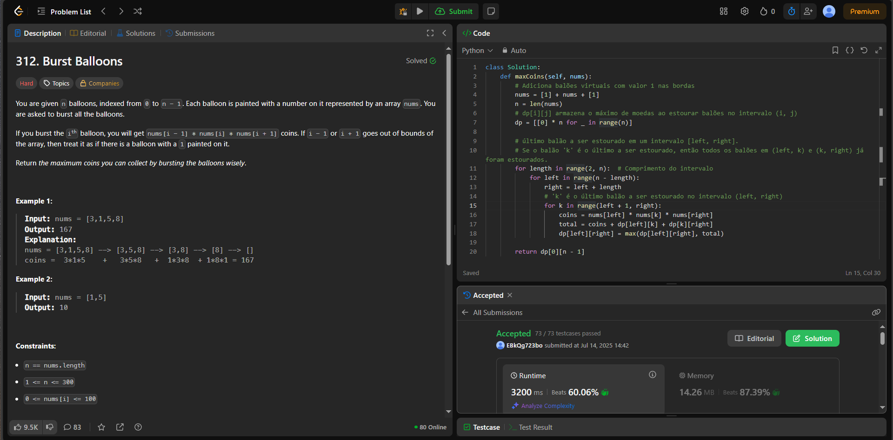
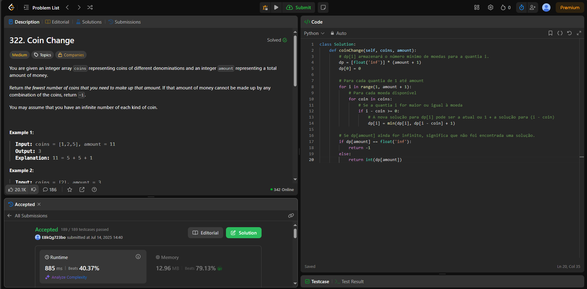

# PD_CodeQuest

**Número da Lista**: 5
**Conteúdo da Disciplina**: Programação Dinâmica

## Alunos

| Matrícula   | Aluno                                                              |
|-------------|--------------------------------------------------------------------|
| 25/1005945  | [Atyrson Souto da Silva](https://github.com/Atyrson)              |
| 21/1063111  | [Gustavo Alves de Souza](https://github.com/gustaallves)          |

## Sobre

Este projeto foi desenvolvido como parte da disciplina de Projeto de Algoritmos e reúne a resolução de diversos exercícios do <a href="https://leetcode.com/problemset/">Leetcode</a> envolvendo estruturas de dados e técnicas de algoritmos, como  Programação Dinâmica. As questões foram divididas entre os integrantes do grupo, de forma que o Gustavo resolveu 2 questões difíceis e 1 de nível médio, enquanto o Atyrson resolveu 1 questão difícil e 2 de nível médio. 

## Screenshots

### 👤 [Atyrson Souto da Silva](https://github.com/Atyrson)

#### 🔴 Questões Difíceis

<table border="1">
  <thead>
    <tr>
      <th>Questão</th>
      <th>Resolução</th>
      <th>Vídeo Explicativo</th>
    </tr>
  </thead>
  <tbody>
    <tr>
      <td><a href="https://leetcode.com/problems/longest-valid-parentheses/description/">32. Longest Valid Parentheses
</a></td>
      <td><a href="./32.cpp">32.cpp</a></td>
      <td><a href="https://youtu.be/b99toQ3EoqU">Link</a></td>
    </tr>
  </tbody>
</table>

  
<strong>Imagem 1 - Resolução do exercício 32</strong>

#### 🟡 Questões Média

<table border="1">
  <thead>
    <tr>
      <th>Questão</th>
      <th>Resolução</th>
      <th>Vídeo Explicativo</th>
    </tr>
  </thead>
  <tbody>
    <tr>
      <td><a href="https://leetcode.com/problems/edit-distance/description/">72. Edit Distance
</a></td>
      <td><a href="./72.cpp">72.cpp</a></td>
      <td><a href="https://youtu.be/b99toQ3EoqU">Link</a></td>
    </tr>
    <tr>
      <td><a href="https://leetcode.com/problems/unique-paths/description/">62. Unique Paths
</a></td>
      <td><a href="./62.cpp">62.cpp</a></td>
      <td><a href="https://youtu.be/b99toQ3EoqU">Link</a></td>
    </tr>
    
  </tbody>
</table>

  
<strong>Imagem 2 - Resolução do exercício 72</strong>

  
<strong>Imagem 3 - Resolução do exercício 62<strong>

---

### 👤 [Gustavo Alves de Souza](https://github.com/gustaallves)

#### 🔴 Questões Difíceis

<table border="1">
  <thead>
    <tr>
      <th>Questão</th>
      <th>Resolução</th>
      <th>Vídeo Explicativo</th>
    </tr>
  </thead>
  <tbody>
    <tr>
      <td><a href="https://leetcode.com/problems/regular-expression-matching/">10. Regular Expression Matching</a></td>
      <td><a href="./10.py">10.py</a></td>
      <td><a href="https://youtu.be/vywX-EearWQ">Link</a></td>
    </tr>
    <tr>
      <td><a href="https://leetcode.com/problems/burst-balloons/">312. Burst Balloons</a></td>
      <td><a href="./312.py">312.py</a></td>
      <td><a href="https://youtu.be/8zeVwd4OuEA">Link</a></td>
    </tr>
  </tbody>
</table>

  
<strong>Imagem 4 - Resolução do exercício 10</strong>

  
<strong>Imagem 5 - Resolução do exercício 312</strong>

#### 🟡 Questão Média

<table border="1">
  <thead>
    <tr>
      <th>Questão</th>
      <th>Resolução</th>
      <th>Vídeo Explicativo</th>
    </tr>
  </thead>
  <tbody>
    <tr>
      <td><a href="https://leetcode.com/problems/coin-change/description/">322. Coin Change</a></td>
      <td><a href="./322.py">322.py</a></td>
      <td><a href="https://youtu.be/6pXgF9MywAc">Link</a></td>
    </tr>
  </tbody>
</table>

  
<strong>Imagem 6 - Resolução do exercício 322</strong>

---

## Como usar o código no LeetCode

Este código foi desenvolvido para ser executado diretamente no **LeetCode**.

### Passos para usar:

1. **Copie o código** do arquivo.
2. **Cole o código no editor do LeetCode**.
3. **Submeta o código**. O LeetCode fornecerá as entradas automaticamente durante a execução.
4. **O LeetCode executará o código** com as entradas fornecidas e devolverá a resposta.

### Detalhes adicionais:

- O LeetCode gerencia as **entradas e saídas automaticamente**.
